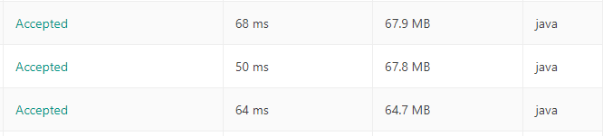

# A Case Study of 77. Combinations

## Combinations V1

### Why so slow?
Recursion with too much array creating, resizing and copying.
## Combinations V2

### Why better memory usage?
By adding backtracking to reuse already allocated ArrayLists
### Why much faster?
Less ArrayList operations = significantly less operations
### Combinations V3

### What's so interesting?
The only significant difference between V2 and V3 is that, I replaced one 
ArrayList.add() and one ArrayList.remove(X.size()-1) with one 
LinkedList.add() and one LinkedList.removeLast(); however, V3 just simply performs worse,
which is another proof that LinkedList sucks 